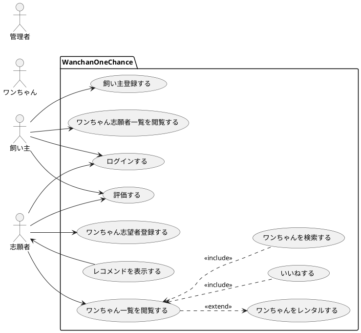

# ユースケース図

```plantuml
@startuml usecase
left to right direction
actor 飼い主 as owner
actor 志願者 as applicant
actor ワンちゃん as wanchan
actor 管理者 as manager

package WanchanOneChance {
  usecase "ログインする" as login
  usecase "飼い主登録する" as registerOwner
  usecase "ワンちゃん志望者登録する" as registerRequestWanchan
  usecase "ワンちゃん一覧を閲覧する" as viewWanchans
  usecase "ワンちゃんをレンタルする" as rentWanchan
  usecase "いいねする" as good
  usecase "ワンちゃんを検索する" as searchWanchan
  usecase "ワンちゃん志願者一覧を閲覧する" as viewRequestWanchan
  usecase "評価する" as assessment
  usecase "レコメンドを表示する" as recommend 
}

owner --> login
applicant --> login
applicant --> registerRequestWanchan
owner --> registerOwner
applicant --> viewWanchans
owner --> viewRequestWanchan
viewWanchans .d.> rentWanchan: <<extend>>
good .u.> viewWanchans: <<include>>
searchWanchan .u.>viewWanchans: <<include>>
owner --> assessment
applicant --> assessment
recommend --> applicant
@enduml
```
