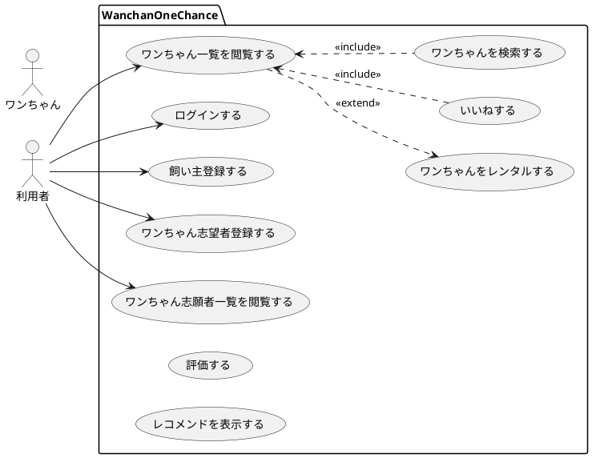

# ユースケース図

```plantuml
@startuml usecase
left to right direction
actor 利用者 as user
actor ワンちゃん as wanchan

package WanchanOneChance {
  usecase "ログインする" as login
  usecase "飼い主登録する" as registerOwner
  usecase "ワンちゃん志望者登録する" as registerRequestWanchan
  usecase "ワンちゃん一覧を閲覧する" as viewWanchans
  usecase "ワンちゃんをレンタルする" as rentWanchan
  usecase "いいねする" as good
  usecase "ワンちゃんを検索する" as searchWanchan
  usecase "ワンちゃん志願者一覧を閲覧する" as viewRequestWanchan
  usecase "評価する" as assessment
  usecase "レコメンドを表示する" as recommend 
}

user --> login
user --> registerRequestWanchan
user --> registerOwner
user --> viewWanchans
user --> viewRequestWanchan
viewWanchans .d.> rentWanchan: <<extend>>
good .u.> viewWanchans: <<include>>
searchWanchan .u.>viewWanchans: <<include>>
@enduml
```
