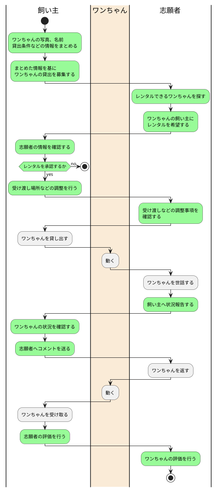
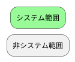

# シナリオフロー

里親募集のWebサイトをマッチングアプリのように俗っぽくしたシナリオイメージ

```plantuml
@startuml
|飼い主|
start
#palegreen:ワンちゃんの写真、名前\n貸出条件などの情報をまとめる;
#palegreen:まとめた情報を基に\nワンちゃんの貸出を募集する;
|#AntiqueWhite|ワンちゃん|
|志願者|
#palegreen:レンタルできるワンちゃんを探す;
#palegreen:ワンちゃんの飼い主に\nレンタルを希望する;
|飼い主|
#palegreen:志願者の情報を確認する;
#palegreen:if (レンタルを承認するか) then (no)
stop
else (yes)
#palegreen:受け渡し場所などの調整を行う;
|志願者|
#palegreen:受け渡しなどの調整事項を\n確認する;
|飼い主|
:ワンちゃんを貸し出す;
|ワンちゃん|
:動く;
|志願者|
:ワンちゃんを世話する;
'最悪の場合、ここで殺されている
#palegreen:飼い主へ状況報告する;
'ここで死体の画像を送ることも想定される
|飼い主|
#palegreen:ワンちゃんの状況を確認する;
#palegreen:志願者へコメントを送る;
|志願者|
:ワンちゃんを返す;
|ワンちゃん|
:動く;
|飼い主|
:ワンちゃんを受け取る;
#palegreen:志願者の評価を行う;
|志願者|
#palegreen:ワンちゃんの評価を行う;
stop
endif
@enduml
```

## 凡例

```plantuml
@startuml
#palegreen:システム範囲;
-[hidden]->
:非システム範囲;
@enduml
```
